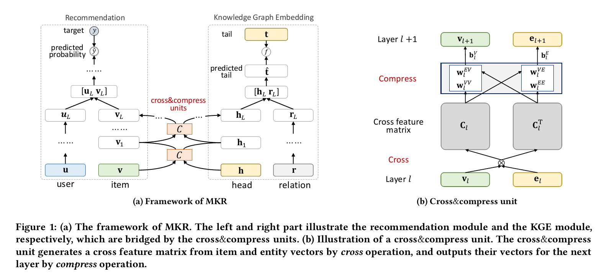
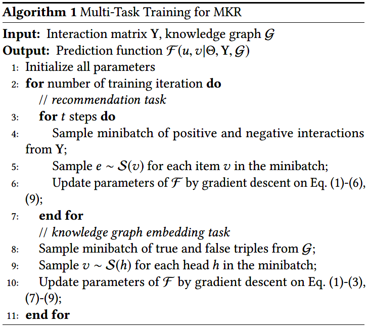

# 知识图谱增强的多任务特征学习的推荐系统
文章地址：https://arxiv.org/abs/1901.08907
代码：https://github.com/hwwang55/MKR
## 摘要
推荐系统里的协同过滤方法在实际场景中经常受到数据稀疏和冷启动问题的困扰。因此，研究人员和工程师们考虑使用辅助信息来解决问题提高推荐系统的表现。在这篇文章里，我们考虑把知识图谱作为辅助信息。在此我们提出了MKR，一种基于知识图谱增强的多任务特征学习方法。MKR是一个深度端到端框架，利用知识图谱的特征来辅助完成推荐系统。这两个任务由cross&compress单元相连，自动共享潜在特征并学习推荐系统中的项目与知识图谱中实体的高阶交互。证明了cross&compress单元有足够的多项式逼近能力，并说明MKR是一个通用的多任务学习框架。通过在现实世界数据集上的大量实验，我们也证明了MKR在电影，书籍，音乐，新闻推荐等方面取得了实质性的收益，达到了最好的baseline。即使在用户交互较少的情形下MKR依然有良好的性能。

## 提出的方法  
### 问题描述
我们把这个知识图谱推荐系统的问题用下面这些公式表示。在一个典型的推荐场景中，我们有一个包含M个用户的集合$U = \{u_1,u_2,... ,u_M\}$和N个物品的集合$V = \{v_1,v_2,... ,v_M\}$，以及用户-物品互动矩阵$Y\in\R^{M\times N}$，这个矩阵定义为用户的信息反馈，$y_{uv}=1$表示用户u与物品v产生了互动，比如说点击，观看，浏览，购买等行为；否则就是0。除此之外，我们还有知识图谱G，由实体-关系-实体的三元组$(h,r,t)$构成。这里的h,r,t分别指三元组的头节点，关系，尾节点。在很多推荐场景中，一个物品$v\in V$可能和知识图谱G中多个实体是相关的。  
在给定了用户-物体交互矩阵Y和知识图谱G后，我们的目标就是预测用户u对之前没有任何互动的物品v是否感兴趣。我们的目标是学到一个预测函数$\hat{y}_{uv} = F(u,v|\Theta,Y,G)$，其中$\hat{y}_{uv}$指的是用户u会与物品v互动的概率，$\Theta$指的是模型的参数。

### 框架

MKR主要由三部分组成：推荐模块，KGE模块，cross&compress模块。  
- 左侧的推荐模块是接受一个用户和一个物品为输入，采用多层感知机和cross&compress单元分别抽取短而密的用户和物品的特征。被抽取的特征再被送入另一个多层感知机最终得出一个预测的概率。
- 和左面的部分类似，右面的部分同样是用多层感知机从知识三元组中的头结点和关系中抽取特征，并在分数函数f和gt的尾节点的监督下预测尾节点。
- 推荐模块和KGE模块通过特别设计的cross&compressio单元桥接。提出的这个单元可以在知识图谱和推荐系统里自动学习到高级的互动特征。

### Cross&compress单元
为了提出一个物体和实体之间的互动特征，我们为MKR方法设计了cross&compress单元。如F1b所示的，对物品v和其中一个有关联的实体e,我们首先构造$d\times d$对在第$l$层的潜在特征：$v_l\in \R^d$和$e_l\in \R^d$:
$$ C_l = v_le_l^\top =
\begin{bmatrix}
    v_l^{(1)}e_l^{(1)} ... v_l^{(1)}e_l^{(d)} \\
    ... ...                                   \\
    v_l^{(d)}e_l^{(1)} ... v_l^{(d)}e_l^{(d)}
\end{bmatrix} (1)$$
其中$C_l\in \R^{d\times d}$是第l层的交叉特征矩阵，d是隐层的维数。这一部分叫做cross操作，因为每个可能的特征互动通过$v_l^{(i)}e_l^{(j)}, \forall(i,j)\in \{1,...,d\}^2$将物品v和其相关联的实体e用这个交叉特征矩阵显式地表达了出来。然后我们通过将交叉特征矩阵和特征空间之间的嵌入（？）输出下一层的物品和实体的特征向量:
$$
\begin{aligned} \mathbf{v}_{l+1} &=\mathbf{C}_{l} \mathbf{w}_{l}^{V V}+\mathbf{C}_{l}^{\top} \mathbf{w}_{l}^{E V}+\mathbf{b}_{l}^{V}=\mathbf{v}_{l} \mathbf{e}_{l}^{\top} \mathbf{w}_{l}^{V V}+\mathbf{e}_{l} \mathbf{v}_{l}^{\top} \mathbf{w}_{l}^{E V}+\mathbf{b}_{l}^{V} \\ \mathbf{e}_{l+1} &=\mathbf{C}_{l} \mathbf{w}_{l}^{V E}+\mathbf{C}_{l}^{\top} \mathbf{w}_{l}^{E E}+\mathbf{b}_{l}^{E}=\mathbf{v}_{l} \mathbf{e}_{l}^{\top} \mathbf{w}_{l}^{V E}+\mathbf{e}_{l} \mathbf{v}_{l}^{\top} \mathbf{w}_{l}^{E E}+\mathbf{b}_{l}^{E} \end{aligned} (2)
$$  
这里的$w_l\in \R^d$和$b_l\in \R^d$都是可训练的权重和偏置向量。这部分叫做compress（压缩）操作，因为使用了权重向量将交叉特征矩阵从$\R^{d\times d}$映射到了特征空间$\R^d$。如公式（2）所示，交叉特征矩阵同时沿着横向和纵向（由操作$C_l$和$C_l^\Tau$实现），这是出于对称考虑的，但我们下面还会提供一些视角。简单来说，交叉压缩单元（cross&compress unit）可以被记为：
$$
[v_{l+1},e_{l+1}] = C(v_l,e_l) \quad (3)
$$
接下来我们使用后缀[v]或[e]来区分两个不同的输出。通过交叉压缩单元，MKR可以适应性地调整知识转换的权值并能学到两种任务间的关联。  
可以注意到，如Fig 1.a所示，交叉压缩单元只在MKR的低层存在。这是因为：
- 在深层结构里，特征通常都是沿着网络从一般到特殊转化，而特征转换过程中会丢失大量的信息，随着层数的增加和任务的不同，高层特征越来越不同。因此，高层特征共享可能会导致*要实现多种任务的MKR的网络负传输的风险增加。（未定）*
- 在MKR的高层中，物品特征和用户特征已经混合了，实体特征也已经和关系特征混合了。混合了的特征不再适合共享，因为它们已经没有了明显的关联。

### 推荐模块
MKR的推荐模块的输入由两个原始的特征向量u和v组成，分别描述用户u和物品v，可以根据场景自定义为独热ID，属性，单词袋，或者这些东西的组合，根据场景需求而定。给出用户u的原始特征向量u，我们用一个L层的MLP来抽取这个用户的潜在的浓缩的特征：
$$
u_L = M(M(...M(u))) = M^L(u) \quad (4)
$$
其中$M(x)=\sigma(Wx+b)$是一个全连接网络【**这里作者提到了可以尝试更换MLP为更好更有效的网络作为进一步工作**】。对于物品v，我们使用L交叉&压缩单元来提取其特征：
$$
V_L = E_{e\sim S(v)}[C_L(v,e)[v]] \quad (5) 
$$
$S(v)$是物品v的关联的实体的集合。  
在有了用户的潜在特征$u_L$和物品v的潜在特征$v_L$后，我们用预测函数$f_{RS}$将这两个特征进行结合，例如内积或者H层MLP。最终的用户u对物品v感兴趣（互动）的概率是：
$$
\hat{y}_{uv} = \sigma(f_{RS}(u_L,v_L)) \quad (6)
$$

### 知识图谱嵌入（提取特征）模块（KGE模块）  
知识图谱嵌入是将实体和特征在保证其结构的前提下嵌入连续的向量空间。最近，研究人员提出了很多KGE（Knowledge Graph Embedding）架构，包括translational distance models,semanic matching models。在MKR中，我们提出了一个深度语义匹配结构(deep semanic matching architecture for KGE)。与推荐模块类似地，对于一个给定的三元组(h,r,t)，我们首先利用多个交叉&压缩单元和非线性层来分别获得头节点h,关系r（包含ID,types,文字表述等）的原始的特征向量。再将它们的浅层特征进行拼接，用一个K层的MLP预测尾节点t:
$$
\begin{array}{l}{\mathbf{h}_{L}=\mathbb{E}_{\boldsymbol{v} \sim \mathcal{S}(h)}\left[C^{L}(\mathbf{v}, \mathbf{h})[\mathbf{e}]\right]} \\ {\mathbf{r}_{L}=\mathcal{M}^{L}(\mathbf{r})} \\ {\hat{\mathbf{t}}=\mathcal{M}^{K}\left(\left[ \begin{array}{c}{\mathbf{h}_{L}} \\ {\mathbf{r}_{L}}\end{array}\right]\right)}\end{array} \quad(7)
$$
其中$S(h)$是实体h关联的物品的集合，$\hat{t}$是预测的尾节点。最终，三元组(h,r,t)的分数通过一个得分（相似度）函数$f_{KG}$得到：
$$
score(h,r,t) = f_{KG}(t,\hat{t}) \quad (8)
$$
其中t是尾节点的GT。在本文中，我们使用标准内积$f_{KG}(t,\hat{t})=\sigma(t^\Tau \hat{t})$作为打分函数，但是其他的相似度度量也是可使用的，比如KL散度。

### 学习算法
MKR完整的损失函数如下所示：
$$
\begin{aligned} \mathcal{L}=& \mathcal{L}_{R S}+\mathcal{L}_{K G}+\mathcal{L}_{R E G} \\=& \sum_{u \in \mathcal{U}, v \in \mathcal{V}} \mathcal{J}\left(\hat{y}_{u v}, y_{u v}\right) \\ &-\lambda_{1}\left(\sum_{(h, r, t) \in \mathcal{G}} \operatorname{score}(h, r, t)-\sum_{\left(h^{\prime}, r, t^{\prime}\right) \notin \mathcal{G}} \operatorname{score}\left(h^{\prime}, r, t^{\prime}\right)\right) \\ &+\lambda_{2}\|\mathbf{W}\|_{2}^{2} \end{aligned} \quad (9)
$$
在等式（9）中，第一项衡量了推荐模块的损失，其中u和v分别穿越了用户和物品的集合，$\mathcal{J}$是交叉熵函数。第二项计算了KGE模块的损失，我们的目标是增加所有正确三元组的分数同时减少所有错误三元组的分数。最后一项是正则化项，用于避免过拟合，$\lambda_1$和$\lambda_2$都是可以调整的参数。  
注意到(9)总得损失函数穿过了所有可能的用户-物品对和三元组。为了让计算更高效，参考前人的工作我们在训练阶段使用负采样的策略。MKR的学习算法如下所示，可以看到训练分成两个阶段：训练推荐任务和训练KGE任务。在每次迭代中，我们在每个epoch里每一次训练KGE任务前重复训练推荐任务t次（t是超参数一般大于1），因为我们更关注提升推荐系统的表现。

## 理论分析
先占坑

## 实验
作者使用现实场景中的推荐需求来衡量算法，其中包括推荐电影，书籍，音乐，新闻。
### 数据集
- MovieLens数据集：一个常见的用于电影推荐的数据集。
- Book-Crossing数据集：在读书论坛上给很多书打分的数据集。
- Last.FM数据集：2000个用户的在Last.fm上听歌的记录
- Bing-News数据集：2016.10.16到2017.8.11的新闻记录，其中每个包含一个新闻的标题和片段。

## Relative Work  
### KGE    
KGE是在保持结构信息前提下将知识图谱里的实体和关系映射到低维向量空间的方法，在MKR中占很大一部分。KGE的方法主要分两种：
- 距离转换方法，通过利用基于距离的得分函数来学习实体和关系的表示，例如TransE系列。
- 语义匹配的模型通过衡量匹配实体和关系之间的潜在的语义关系的可行性。例如RESCAL，ANALOGY,HolE。
最近，研究者也提出了一些包含多种辅助信息，例如实体类型，逻辑规则，文字描述等等的KGE方法。上述KGE方法也可以被MKR采用，但是如果这样的话交叉压缩单元也要重新设计 ***这里相当于作者提出了一个供后人进一步工作的思路***。尝试其他的KGE构造和关联模块也是未来工作的重要方向。