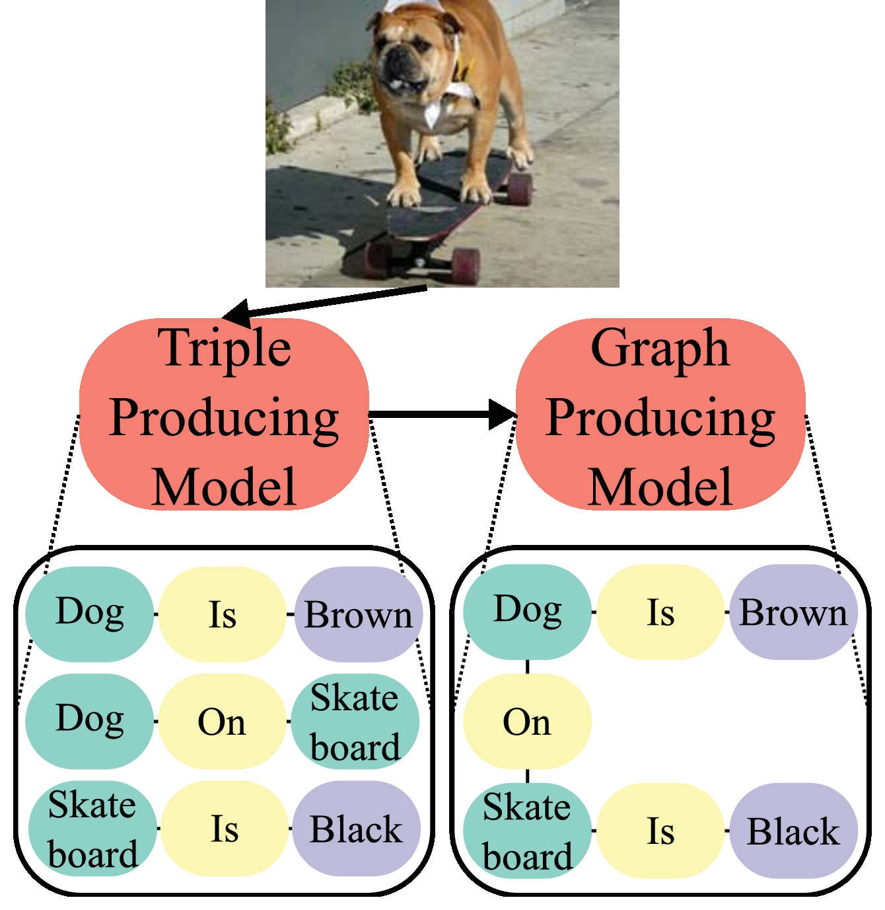
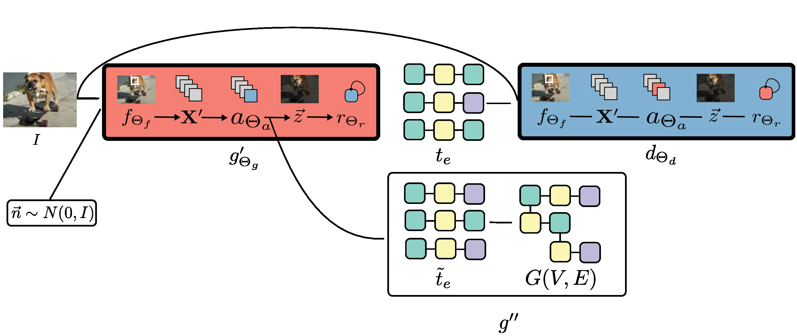

### 摘要
受到深度学习的成功的影响，计算机视觉方面的研究除了能完成目标检测和图像分类工作之外变得更加强大能完成更复杂的任务，比如图像捕捉，视觉问题回答。这些努力都在使得模型不仅仅能捕捉图片上的物体，更能进一步理解场景的层面例如物体的属性，关系等。场景的图提供了一个正式的用于捕捉图像信息的结构。尽管如此，近期很少有工作是关于从图像到关系图的。之前的工作都局限在了训练时设置有效的bounding box而不是试图生成带有属性信息的场景图。本文提出了一种基于在近期取得极大进展的GAN的方法，来解决这些问题。我们的方法首先生成一些小的子图，其中每一个都表示在attention机制下筛选出的特殊的位置关系。这样，我们的方法可以在不借助bounding box信息的情况下生成属性信息。实验证明我们取得了sota的效果。进一步，我们说明了我们的模型相较于前人的工作词汇量也更大。

### 对本文方法的直观展示

### Contributions  
- 提出了一个新的GAN模型，能够生成场景里的对象关系和属性语句的三元组。
- 使用了注意力机制从图像的不同部分生成子图，再将这些子图进行拼接。
- 经验证明提出的模型取得了最好的效果，同时能够对对象属性进行建模。

### 从图像生成场景图
#### 问题定义
这项工作的目标是找到场景图像和场景图之间的映射，具体地说，我们试图去学$g_\theta:I\rightarrow G$从彩色图像$I\subset R^{d_1 \times d_2 \times 3}$到场景图$G=(V,E)$的映射。每个顶点$v\in V$和边$e = (v_1^e,v_2^e)$由词汇表V中的词汇标记。而这个图中的每个边都是一个“三元组”。设$l_e$为边$e$的标签,$l_v$为顶点$v$的边。每个边$e=\left(v_{1}, v_{2}\right) \in \mathrm{E}$都可以化为三元组$t_{e}=\left(l_{v_{1}}, l_{e}, l_{v_{2}}\right)$的格式。这是结构化的数据，以主谓宾的形式存在。而本文中所使用的场景中，这种三元组要么描述场景中两个对象的关系，要么说明对象的属性。有了上面这些定义，我们可以明确，每个三元组可以描述场景中的一些内容，而这些内容的组合可以共同描述某个物体，即一个顶点，这实际上是两个部分。首先在给定图像的情况下生成三元组将图像映射到场景图，然后解析相同的对象来构建合适的场景图。更正式的说，我们选择首先找到映射$g_{\Theta}^{\prime} : I \mapsto \mathcal{V} \times \mathcal{V} \times \mathcal{V}$以在场景上找到三元组，然后映射$g^{\prime \prime} :\{\mathcal{V} \times \mathcal{V} \times \mathcal{V}\}^{n} \mapsto G$从三元组中生成场景图。

#### 三元组生成网络
为了生成三元组，本文提出了基于CNN,RNN,GAN的网络架构。网络由两部分组成，第一部分的结果会进入第二部分。首先是特征提取器：$f_{\Theta_{f}} : I \mapsto I^{\prime}$，使用全卷积网络将图片映射到相应的feature map.这一映射产生了L个特征，每个特征属于$R^D$，其中D对应于$f_{\Theta_{f}}$中的卷积核数。这些特征被送入循环组件$r_{\Theta_{r}} : I^{\prime} \mapsto \mathcal{V} \times \mathcal{V} \times \mathcal{V}$中。更具体地说，使用LSTM从三个时间步上输出词汇表中的词。给定视觉特征$\mathbf{X}_{t}^{\prime} \in I^{\prime}$，时间t的LSTM单元如下定义：  
$$\begin{aligned} \vec{f}_{t} &=\sigma\left(W_{f} \mathbf{X}_{t}^{\prime}+U_{f} \vec{h}_{t-1}+b_{f}\right) \\ \vec{i}_{t} &=\sigma\left(W_{i} \mathbf{X}_{t}^{\prime}+U_{f} \vec{h}_{t-1}+b_{i}\right) \\ \vec{o}_{t} &=\sigma\left(W_{o} \mathbf{X}_{t}^{\prime}+U_{o} \vec{h}_{t-1}+b_{o}\right) \\ \vec{c}_{t} &=f_{t} \circ \vec{c}_{t-1}+\vec{i}_{t} \circ \tanh \left(W_{c} \mathbf{X}_{t}^{\prime}+U_{c} \vec{h}_{t-1}+b_{c}\right) \\ \vec{h}_{t} &=o_{t} \circ \tanh \left(\vec{c}_{t}\right) \end{aligned}
$$中间详细过程：\#TODO  
LSTM三步循环生成三元组。注意如上所定义的，循环分量的唯一输入时卷积分量的输出。因此，每个输入图像仅生成一个三元组。因为场景中包含很多具有不同关系和属性的不同对象，故希望生成器能在给定图像的情况下对三元组的分布进行建模。**近期使用GAN生成结构化数据方面取得了成功**，本文使用了对抗策略来训练生成器。

#### 三元组生成网络的对抗网络
为了训练$g_{\Theta_{g}}^{\prime}$，我们将其与鉴别器$d_{\Theta_{d}}$进行对抗：$(V \times V \times V) \times I^{\prime} \mapsto[0,1]$，其中$V=[0,1]^{|\mathcal{V}|}$。$d_{\Theta_{d}}$的目标是在给定图像的情况下，将ground truth的真实三元组$g_{\Theta}^{'}$的三个输出和生成器生成的三个独热向量区分开。在对抗游戏中，生成器和判别器是“串联”训练的。生成器的循环组件采用与随机向量$\vec{n} \sim \mathcal{N}(0, \mathbf{I})$链接的图像$X^{'}$的视觉特征，并生成三元组$\tilde{t}_{e}=\left(v_{1}, v_{2}, v_{3}\right)$。输入的随机噪声部分确保$g_{\Theta}^{\prime}$在给定$\mathbf{X}^{\prime}$时不会产生唯一一个三元组，而是会产生多种三元组。若将生成器视为概率分布，则可以$\mathbf{X}^{\prime}$连接到$\vec{n}$上作为条件。  
损失函数：$\mathcal{L}\left(\mathbf{X}^{\prime}, \vec{n} ; \Theta_{g}, \Theta_{d}\right)=d_{\Theta_{d}}\left(g_{\Theta_{g}}^{\prime}\left(\vec{n} | \mathbf{X}^{\prime}\right) | \mathbf{X}^{\prime}\right)-d_{\Theta_{d}}\left(t_{e} | \mathbf{X}^{\prime}\right)$  
\#TODO这部分也还没做完

#### 源于注意力的图构造
注意机制是可训练参数的区分函数，将一些特征作为输入，输出所述特征的相对重要性。本文使用的机制如下：   
$$
\begin{aligned} e_{t i} &=a_{\Theta_{a}}\left(\vec{x}_{i}^{\prime}, \vec{h}_{t-1}\right) \\ \alpha_{t i} &=\frac{\exp \left(e_{t i}\right)}{\sum_{k=1}^{L} \exp \left(e_{t k}\right)} \\ \vec{z}_{t} &=\sum_{i=1}^{L} \alpha_{t i} \vec{x}_{i}^{\prime} \end{aligned}
$$
这里的$a_{\Theta_{a}}$是一个多层感知器，它接受输入卷积特征$\vec{x_i}$和循环组件的前一步$\vec{h_{t-1}}$的隐藏状态，并产生一个向量$\vec{e_t}$，其中每个元素是$X_{t}^{\prime}$中每个视觉特征的相对重要性。再用$softmax$对该向量进行归一化形成$\vec{\alpha_t}$。最后，$\vec{\alpha_t}$的元素用于权衡L视觉特征以生成向量$\vec{z}_{t} \in \mathbb{R}^{D}$,这个向量会作为循环组件$^{-} r_{\Theta_{T}}$的输入，因此不会使用$X_{t}^{\prime}$中的所有视觉特征。

#### 整体的架构

输入图像I和噪声$\vec{n}$首先被送进生成器$g_{\Theta_{g}}$（红色），它使用CNN$f_{\Theta_{f}}$处理图像，生成图像特征$X^\prime$，将它们传递给生成动态图像表示的注意机制$a_{\Theta_{a}}$，动态图表示$\overline{z}$和注意向量$\vec{\alpha}$。$\overline{z}$被送入LSTM生成三元组$\tilde{t}_{e}$。在训练期间，这些三元组和gt三元组$t_e$一起传递给具有和生成器相同组建的鉴别器$d \Theta_{d}$。鉴别器只产生分数。在测试时，所有的$\tilde{t}_{e}$和$\alpha$都传递给$g_{\prime \prime}$，后者将三元组解析为图$G(V,E)$。
### 实验
使用了VG（Visual Genome）数据集（迄今为止最大的图像-场景数据集）。特征提取器$f \Theta_{f}$是使用的现成的卷积网络，只在图像分类任务上训练过。使用adam方法训练生成器判别器，在图构建阶段，，使用一般的IoU标准度量匹配超过80%的被视为重复实体。在实体有多个标签的情况下，使用投票来决定标签。VG包含超过108,000个图像/场景图对。创建了这些对的两个分裂分割。第一次分割完全匹配对比的工作（Xu et al.2017），这是将前150个对象类的数据集的70%-30%训练测试分割和词汇量大小为200的50个关系。第二次拆分也是70%-30%训练测试拆分，但包括400种最常见的对象类，150种最常见的关系，以及150种最常见的属性。第一次分割允许我们将我们的模型直接与报告的结果进行比较（Xu et al.2017）。第二种不仅将词汇扩展到更多的关系，而且还包括属性，使我们能够在更多种可能的三元组和更复杂的场景图上评估我们的模型。  
准确率公式：
$$r @ k=\frac{\left|\tilde{t}_{e} \cap t_{e}\right|}{\left|t_{e}\right|}$$
